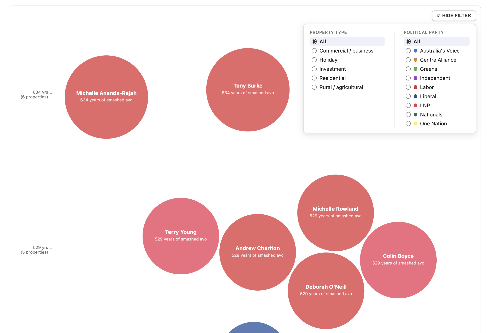

# Pollywaffle

An Australian federal politician property-affordability
visualisation: balloon size is a politician's declared property count,
vertical position is a "years of buying a $22 smashed avocado on
toast every day" affordability calculation, colour is party.

Pollywaffle is built on **Balloon Race**, an independent, reusable
interactive data-visualisation engine (`src/balloon-race/`) inspired by
the visual grammar and interaction model of Information Is Beautiful's
VizSweet Balloon Race visualisations.

**Snake Oil** (scientific evidence for nutritional supplements) remains in
the project as the engine's original reference fixture — useful for
regression testing, visual comparison, and demonstrating that the engine
supports more than one dataset — but it is not the product this app
ships; see the "Engine reference: Snake Oil" link in the running app.



## Setup

Requires Node.js 20+ (developed against Node 24) and npm.

```bash
git clone https://github.com/markradomski/balloon-race.git
cd balloon-race
npm install
npm run dev
```

Then open the URL Vite prints (defaults to http://localhost:5173) — this
opens Pollywaffle. Use the "Engine reference: Snake Oil" link at the top
of the page to view the reference fixture.

## Stack

React + TypeScript + Vite + D3 (focused packages only) + SVG + CSS Modules

- Zod + Vitest + React Testing Library.

## Structure

```
src/
├── app/                    # Application shell — defaults to Pollywaffle
├── balloon-race/           # The generic, reusable Balloon Race engine
│   ├── components/         # <BalloonRace />
│   ├── model/               # BalloonDatum, BalloonMapping, BalloonRaceConfig
│   ├── data/                 # normalize, validate, load (CSV/text)
│   ├── scales/                # value + radius (sqrt/area) scales
│   ├── layout/                  # force simulation, packing, semantic bands
│   └── hooks/                     # useContainerSize (ResizeObserver)
├── examples/
│   ├── pollywaffle/         # Pollywaffle dataset adapter + the product page
│   └── snake-oil/           # Snake Oil dataset adapter + reference fixture
└── fixtures/
    ├── pollywaffle/          # Local, offline Pollywaffle CSV fixture
    └── snake-oil/            # Local, offline Snake Oil CSV fixture
```

The engine (`src/balloon-race/`) knows nothing about either dataset — see
`src/examples/pollywaffle/pollywaffleAdapter.ts` or
`src/examples/snake-oil/snakeOilAdapter.ts` for how a dataset plugs in.
`BalloonRace`, `BalloonDatum`, `BalloonConfig`, and the layout/packing
utilities are generic engine concepts and stay dataset-agnostic — neither
example is allowed to leak its own semantics into them.

## Commands

```bash
npm install
npm run dev          # start the dev server (opens Pollywaffle)
npm run build         # typecheck + production build
npm test               # run the Vitest suite once
npm run test:watch      # Vitest watch mode
npm run lint              # oxlint
```

## Dataset fixtures

Both `src/fixtures/pollywaffle/pollywaffle-2025.csv` and
`src/fixtures/snake-oil/snake-oil.csv` are committed, offline snapshots of
their public sources — the app never fetches external data at runtime. To
refresh a fixture, see the corresponding `scripts/import-<dataset>.mjs`
and that fixture directory's own README for provenance details.
